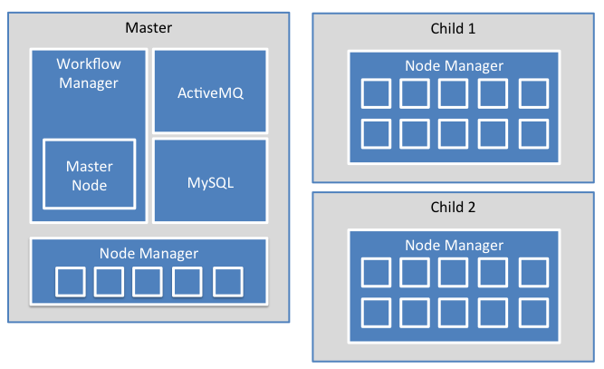

> **NOTICE:** This software (or technical data) was produced for the U.S. Government under contract, and is subject to the Rights in Data-General Clause 52.227-14, Alt. IV (DEC 2007).
Copyright 2016 The MITRE Corporation. All Rights Reserved.

# Minimum Resource Requirements

## Hardware
MPF performs best when processing is distributed across a cluster of computers; a minimum of one dedicated server is required that provides the following:

  - 4 Central Processing Units (CPUs)
  - 4GB Random Access Memory (RAM), *although in any operational use case environment at least 16GB of RAM is recommended*
  - 40GB hard disk space, *with additional space to store media and processed objects*

In a cluster configuration, participating servers are referred to as *nodes*, with one controlling node designated as the *master* node and the others designated as *child* nodes.  In this case, a shared file system accessible to all participating nodes is also required.

The *master* contains the Workflow manager, ActiveMQ, MySQL, an instance of the MPF process manager, named the *Node Manager*. A *child* contains only a node manager and processing components/algorithms.

Below is an example layout of an MPF cluster consisting of 3 nodes:



## Operating System and Software
MPF runs on the CentOS 7 operating system, with Linux firewall (iptables) disabled and Linux SELINUX in permissive state (disabled is the preferred state to limit logging activity).

A browser is required in order to utilize the MPF Web User Interface (UI). The officially supported browsers are FireFox and Chrome. Although other browsers might work, they have not been thoroughly tested and might not display or function properly.

## MPF Pre-Installation
> **Important:** Please verify that all steps in the Pre-installation Checklist are completed **prior** to cluster configuration.

## Pre-Installation Checklist


## MPF Installation

> You only need to complete the following steps on the MPF master node.

** 1. Install and Configure MPF Management Software **

Copy the MPF release package .tar.gz, (e.g. mpf-0.4.0+develop-394-d646a55e.tar.gz) to the MPF master node.

From the MPF master node, unpack the MPF package.

```
tar zxvf <latest .tar.gz>
cd mpf-release
sudo sh install-mpf.sh
```

** 2. Configure the MPF Cluster **

> Note: A master node will __**not**__ run any services unless it is also designated and configured as a child. Think of a child as a worker in the MPF cluster. Thus, in a single server environment it is mandatory to designate the host as both a master and child in order to do any meaningful processing (e.g. detection). By default, the master only runs the workflow manager web app, AMQ, Redis and MySQL.

> Note: When prompted for username and password, use the same username and password you used to log in to the master node.

> Note: When prompted for hostnames, only put in the hostnames (e.g., node-1), DO NOT put in the fully qualified domain name (e.g., node-1.example.org) or MPF will behave in strange ways.

```
sudo sh /opt/mpf/manage/configure-cluster.sh
```

** 3. Push MPF Configuration to MPF Nodes**

> Note: Early in the script you will be prompted for the MPF password. Use "mpf".


```
# As the "mpf" user (you may need to log out and log back in):
. /opt/mpf/manage/push-configuration.sh
```

** 4. Complete Node Configuration **

MPF is now running (no reboot required).

To complete node configuration:

  1. From the master node, browse to: http://localhost:8080/workflow-manager
  2. Login as the administrator (username: "admin" / password: "mpfadm")
  3. Go to the Node Configuration page
  4. Drag and drop desired services to the nodes
  5. Click Save Configuration and then browse to the Node and Process Status page to ensure the configuration is executing as desired

## Updating Site Configuration

You can add or remove nodes and change other configuration options once MPF has already been installed.

```
# As the "mpf" user:
mpf stop
sudo sh /opt/mpf/manage/configure-cluster.sh
/opt/mpf/manage/push-configuration.sh
```

## Creating a Keystore

> IMPORTANT: This is not recommended for a production environment.

These instructions will create a keystore with a self-signed certificate at /home/mpf/.keystore.

1. Open a new terminal window.
2. `sudo systemctl stop tomcat7`
3. `cd /home/mpf`
4. `keytool -genkey -alias tomcat -keyalg RSA`
5. At the prompt, enter a keystore password of: `mpf123`
6. Re-enter the keystore password of: `mpf123`
7. At the `What is your first and last name?` prompt, press the Enter key for a blank value.
8. At the `What is the name of your organizational unit?` , press the Enter key for a blank value.
9. At the `What is the name of your organization?` prompt, press the Enter key for a blank value.
10. At the `What is the name of your City or Locality?` prompt, press the Enter key for a blank value.
11. At the `What is the name of your State or Province?` prompt, press the Enter key for a blank value.
12. At the `What is the two-letter country code for this unit?` prompt, press the Enter key for a blank value.
13. At the `Is CN=Unknown, OU=Unknown, O=Unknown, L=Unknown, ST=Unknown, C=Unknown correct?` prompt, press the Enter key to accept the values.
14. At the `Enter key password for <tomcat>` prompt, press the Enter key for a blank value.
15. Verify the file `/home/mpf/.keystore` was created at the current time.
