> **NOTICE:** This software (or technical data) was produced for the U.S. Government under contract, and is subject to the Rights in Data-General Clause 52.227-14, Alt. IV (DEC 2007).
Copyright 2016 The MITRE Corporation. All Rights Reserved.

# General

## Accessing the Web UI

On the server hosting the Open Media Processing Framework (OpenMPF), the Web UI is accessible at http://localhost:8080/workflow-manager. To access it from other machines, substitute the hostname or IP address of the master node server in place of "localhost".

The OpenMPF user interface (UI) was designed and tested for use with Chrome and FireFox. It has not been tested with other browsers. Attempting to use an unsupported browser will result in a warning.

## Logging In

The OpenMPF Web UI requires user authentication and provides two default accounts: "mpf" and "admin". The password for the "mpf" user is "mpf123". These accounts are used to assign user or admin roles for OpenMPF cluster management. Note that an administrator can remove these accounts and/or add new ones using a command line tool. Refer to the [Admin Guide](Admin-Manual/) for features available to an admin user.



The landing page for a non-admin user is the Job Status page:

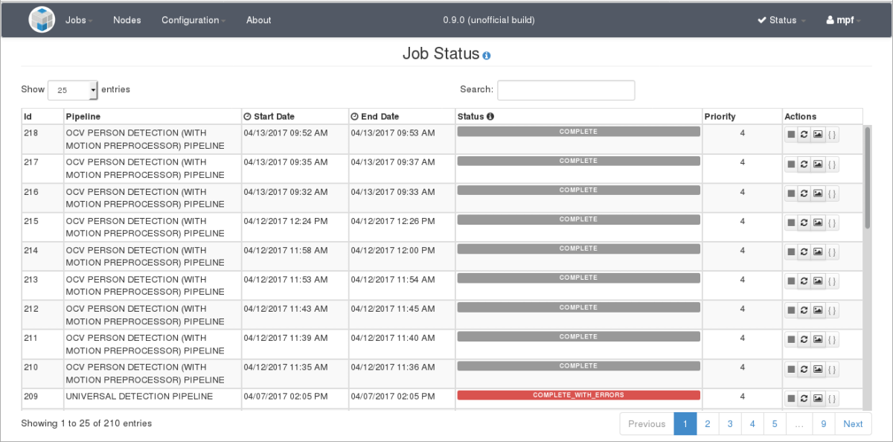

Logging in starts a user session. By default, after 30 minutes of inactivity the user will automatically be logged out of the system. Within one minute of logging out the user will be prompted to extend or end their session. Note that the timeout period can be configured by any admin user with the admin role.

A given user can only be logged into the OpenMPF from one machine using one browser at a time. If the same user attempts to log in from another machine, or another browser on the same machine, then the first user session will be terminated immediately and redirected back to the login page. This feature ensures that the user will be able to immediately log in again if the user accidentally closes the browser window or shuts down their machine without properly logging out first.

A user may have multiple browser tabs or windows open for the same session, for example, to view the Jobs Status page and Logs page at the same time. It is not recommended that two users login using the same browser at the same time in different tabs or windows. Technically, the second user to login will take precedence, but the first user session will not appear to be terminated. Instead the first user will appear to share recently uploaded media, recent jobs, and other information with the second user. Also, when one of the users logs out in this scenario, they will both be logged out.

Once logged in, the left-hand sidebar shows the Workflow Manager (non-admin) options and the Admin Console options. Note that only the "admin" user has access to the full capabilities within the Admin Console, including node configuration, resetting system properties, and stopping and starting processes across the cluster. A non-admin user can view the status of processes in the Admin Console but cannot alter the node configuration or stop and start processes.

## Logging out

To log out a user can click the down arrow associated with the user icon at the top right hand corner of the page and then select "Logout":

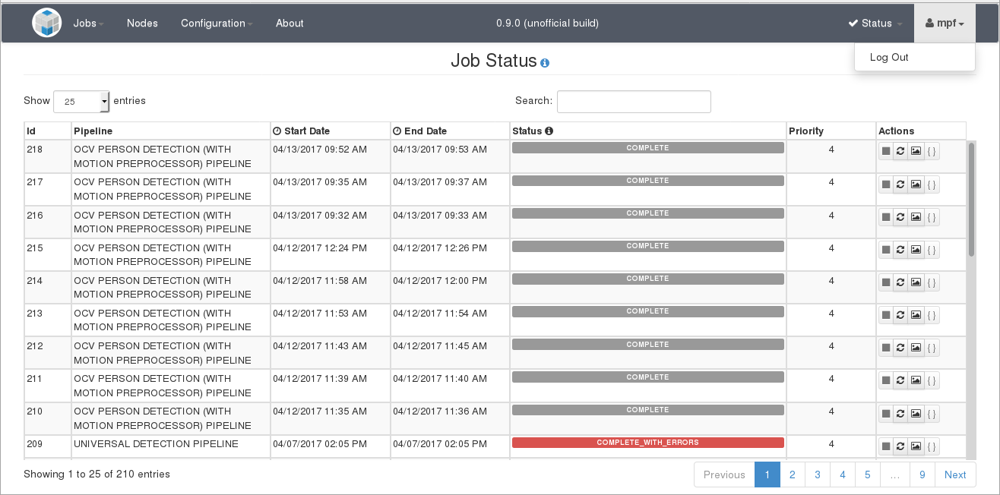

# User (Non-Admin) Features

The remainder of this document will describe the features available to a non-admin user.

## Creating Workflow Manager Jobs

A "job" consists of a set of image, video, or audio files and a set of exploitation algorithms that will operate on those files.  A job is created by assigning input media file(s) to a pipeline.  A pipeline specifies the order in which processing steps are performed. Each step consists of a single task and each task consists of one or more actions which may be performed in parallel. The following sections describe the UI views associated with the different aspects of job creation and job execution.

## Create Job / View Media

This is the primary page for creating jobs. Creating a job consists of uploading and selecting files as well as a pipeline and job priority.

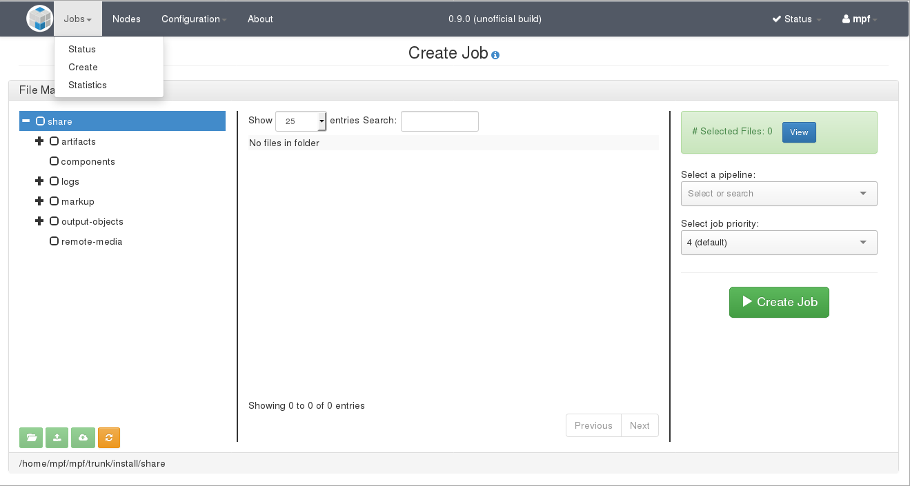

### Uploading Files

Selecting a directory in the File Manager will display all files in that directory.  The user can use previously uploaded files, or to choose from the icon bar at the bottom of the panel:

 Create New Folder
 Add Local Files
 Upload from URL
 Refresh

Note that the first three options are only available if the "remote-media" directory or one of its subdirectories is selected. That directory resides in the OpenMPF share directory. The full path is shown in the footer of the File Manager section.

Clicking the "Add Local Files" icon will display a file browser dialog so that the user can select and upload one or more files from their local machine. The files will be uploaded to the selected directory. The upload progress dialog will display a preview of each file (if possible) and whether or not each file is uploaded successfully.

Clicking the "Create New Folder" icon will allow the user to create a new directory within the one currently selected. If the user has selected "remote-media", then adding a directory called "Test Data" will place it within "remote-media". "Test Data" will appear as a subdirectory in the directory tree shown in the web UI. If the user then clicks on "Test Data" and then the "Add Local Files" button the user can upload files to that specific directory. In the screenshot below, "lena.png" has been uploaded to the parent "remote-media" directory.

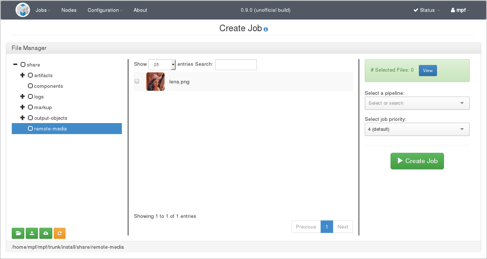

Clicking the "Upload from URL" icon enables the user to specify URLs pointing to remote media. Each URL must appear on a new line. Note that if a URL to a video is submitted then it must be a direct link to the video file. Specifying a URL to a YouTube HTML page, for example, will not work.

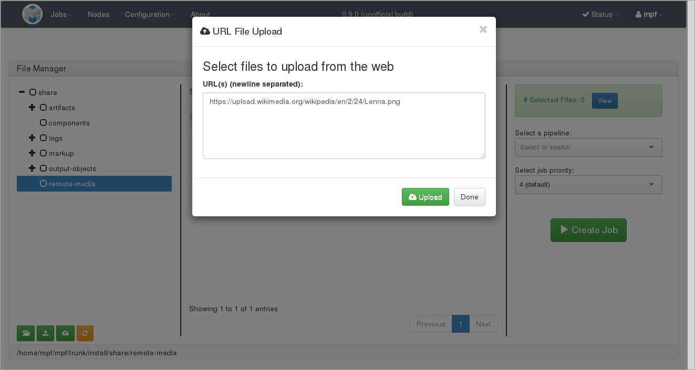

Clicking the "Refresh" icon updates the displayed file tree from the file system. Use this if an external process has added or removed files to or from the underlying file system.

### Creating Jobs

Creating a job consists of selecting files as well as a pipeline and job priority.

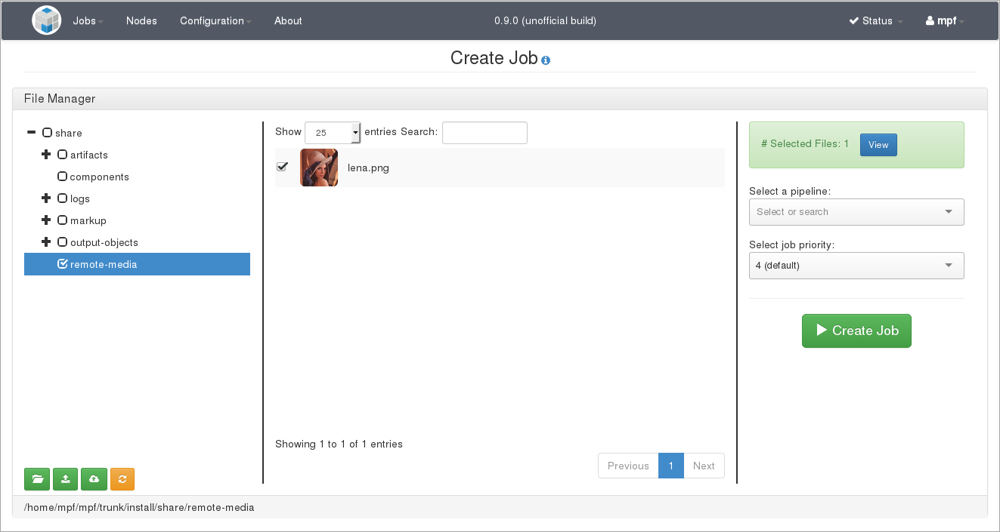

Files are selected by first clicking the name of a directory to populate the files table in the center of the UI and then clicking the checkbox next to the file. Multiple files can be selected, including files from different directories. Also, the contents of an entire directory, and its subdirectories, can be selected by clicking the checkbox next to the parent directory name. To review which files have been selected, click the "View" button shown to the right of the "# Files" indicator.  If there are many files in a directory, you may need to page through the directory using the page number buttons at the bottom of the center pane.

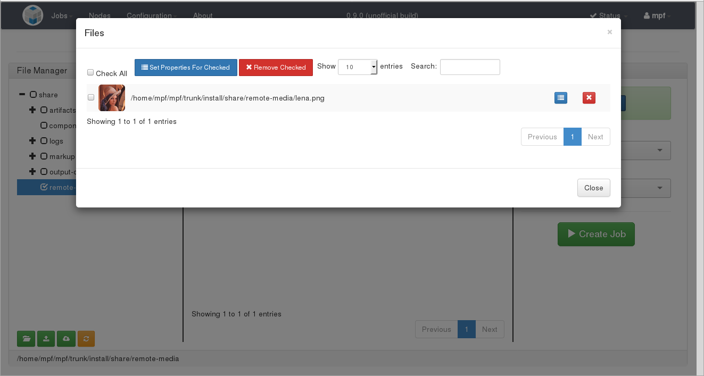

After files have been selected it's time to assign a pipeline and job priority. The "Select a pipeline and job priority" section is located on the right side of the screen.  Clicking on the down-arrow on the far right of the "Select a pipeline" area displays a drop-down menu containing the available pipelines.  Click on the desired pipeline to select it. Existing pipelines provided with the system are listed in the Default Pipelines section of this document.

"Select job priority" is immediately below "Select a pipeline" and has a similar drop-down menu.  Clicking on the down-arrow on the right hand side of the "Select job priority" area displays the drop-down menu of available priorities.  Clicking on the desired priority selects it.  Priority 4 is the default value used if no priority is selected by the user. Priority 0 is the lowest priority, and priority 9 is the highest priority. When a job is executed it's divided into tasks that are each executed by a component service running on one of the nodes in the OpenMPF cluster. Each service executes tasks with the highest priority first. Note that a service will first complete the task it's currently processing before moving on to the next task. Thus, a long-running low-priority task may delay the execution of a high-priority task.

After files have been selected and a pipeline and priority are assigned, clicking on the "Create Job" icon will start the job.  When the job starts, the user will be shown the "Job Status" view.

## Job Status

The Job Status page displays a summary of the status for all jobs.  Selecting the "Session" tab in the upper left displays all jobs for the current user's session, while selecting "All" displays the status of all jobs including those for the current user's session and those run by any user in the past. The current status and progress of any running job can be monitored from this view, which is updated automatically.

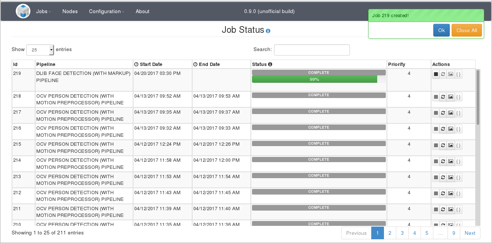

When a job is COMPLETE a user can view the generated JSON output object data by clicking the "Output Objects" button for that job. A popup will be displayed with a link to the detection output.

Clicking the link for the detection object output displays a formatted JSON representation of the detection results:

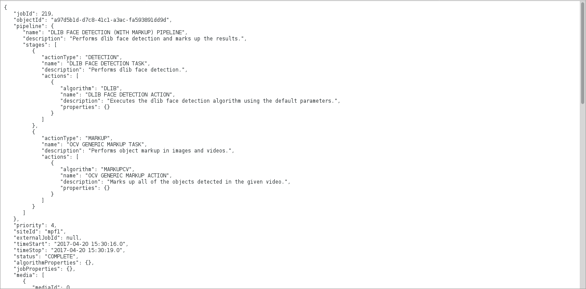

A user can click the "Cancel" button to attempt to cancel the execution of a job before it completes. Note that if a service is currently processing part of a job, for example, a video segment that's part of a larger video file, then it will continue to process that part of the job until it completes or there is an error. The act of cancelling a job will prevent other parts of that job from being processed. Thus, if the "Cancel" button is clicked late into the job execution, or if each part of the job is already being processed by services executing in parallel, it may have no effect. Also, if the video segment size is set to a very large number, and the detection being performed is slow, then cancelling a job could take awhile.

A user can click the "Resubmit" button to execute a job again. The new job execution will retain the same job id and all generated artifacts, marked up media, and detection objects will be replaced with the new results. The results of the previous job execution will no longer be available. Note that the user has the option to change the job priority when resubmitting a job.

## Media Markup Results

This view will display the path of the source medium and the marked up output path of any media processed using a pipeline that contains a markup action. The table is refreshed every time the user visits the page, but it can also be manually refreshed with the "Refresh" button. The "View" button will be enabled for marked up image data. Clicking it will display a popup with the marked up image. Note that the "View" button will be disabled for marked up video data. In any case, the marked up data can be downloaded to the machine running the web browser by clicking "Download".

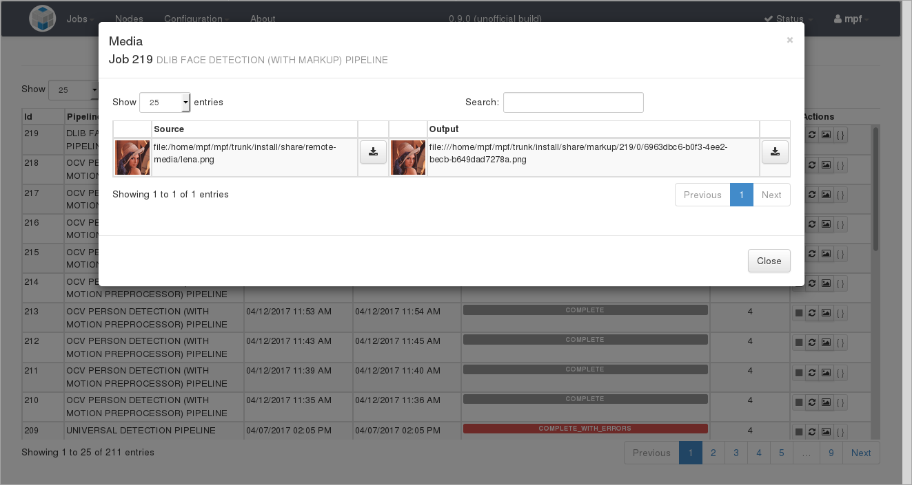


## Create Custom Pipelines

A pipeline consists of a series of tasks executed sequentially. A task consists of a single action or a set of two or more actions performed in parallel. An action is the execution of an algorithm. The ability to arrange tasks and actions in various ways provides a great deal of flexibility when creating pipelines. Users may combine pre-existing tasks in different ways, or create new tasks based on the pre-existing actions.

Selecting "Create Custom Pipelines" from the Workflow Manager menu brings up the Pipeline Creation View, which enables users to create new pipelines. To create a new action, the user can scroll to the "Create A New Action" section of the page and select the desired algorithm from the "Select an Algorithm" dropdown menu:

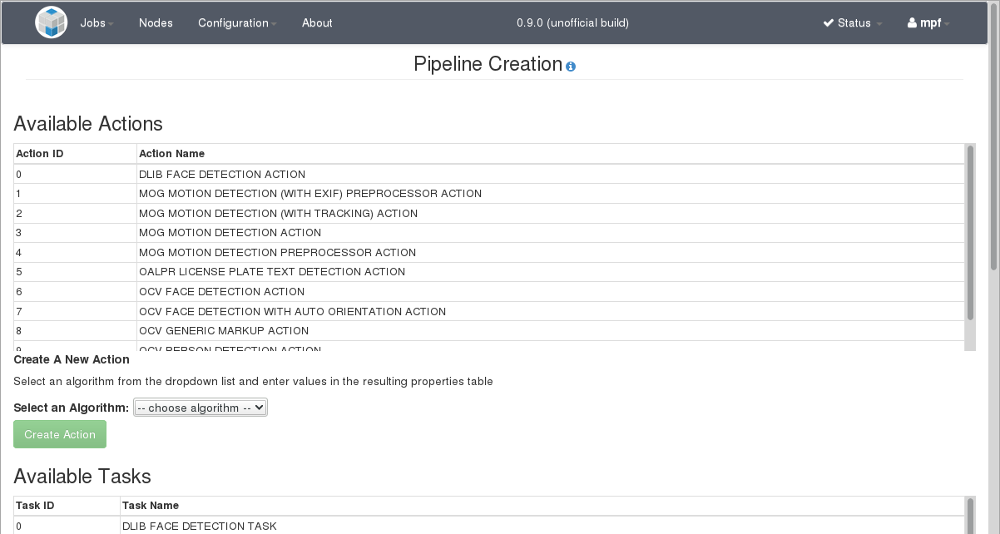

Selecting an algorithm will bring up a scrollable table of properties associated with the algorithm, including each property�s name, description, data type, and an editable field allowing the user to set a custom value. The user may enter values for only those properties that they wish to change; any property value fields left blank will result in default values being used for those properties. For example, a custom action may be created based on the OpenCV face detection component to scan for faces equal to or exceeding a size of 100x100 pixels.

When done editing the property values, the user can click the "Create Action" button, enter a name and description for the action (both are required), and then click the "Create" button. The action will then be listed in the "Available Actions" table and also in the "Select an Action" dropdown menu used for task creation.



To create a new task, the user can scroll to the "Create A New Task" section of the page:

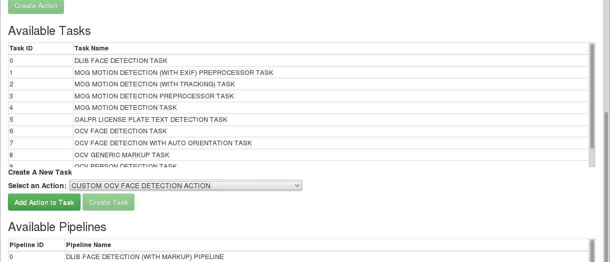

The user can use the "Select an Action" dropdown menu to select the desired action and then click "Add Action to Task". The user can follow this procedure to add additional actions to the task, if desired. Clicking on the "Remove" button next to an added action will remove it from the task. When the user is finished adding actions the user can click "Create Task", enter a name and description for the task (both are required), and then click the "Create" button. The task will be listed in the "Available Tasks" table as well as in the "Select a Task" dropdown menu used for pipeline creation.

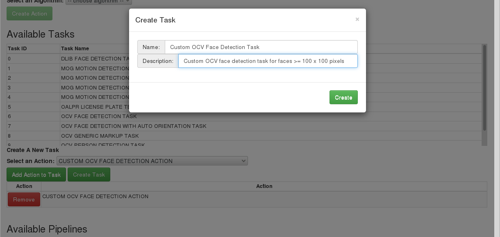

To build a new pipeline, the user can scroll down to the "Create A New Pipeline" section of the page:

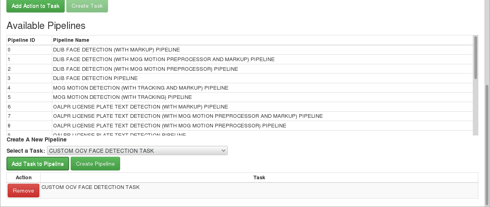

The user can use the "Select a Task" dropdown menu to select the first task and then click "Add Task to Pipeline". The user can follow this procedure to add additional tasks to the pipeline, if desired. Clicking on the "Remove" button next to an added task will remove it from the pipeline. When the user is finished adding tasks the user can click "Create Pipeline", enter a name and description for the pipeline (both are required), and then click the "Create" button. The pipeline will be listed in the "Available Pipelines" table.

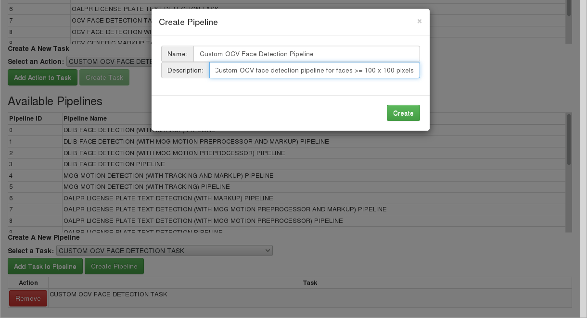

All pipelines successfully created in this view will also appear in the pipeline drop down selection menus on any job creation page:

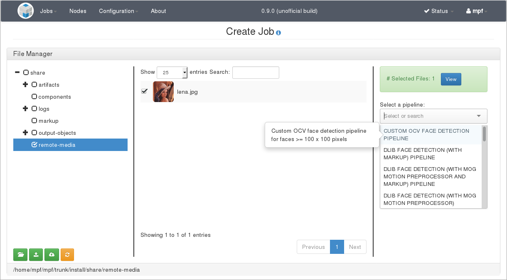

> NOTE: Pipeline, task, and action names are case-insensitive. All letters will be converted to uppercase.

## Logs

This page allows a user to view the various log files that are generated by system processes running on the various nodes in the OpenMPF cluster. A log file can be selected by first selecting a host from the "Available Hosts" drop-down and then selecting a log file from the "Available Logs" drop-down. The information in the log can be filtered for display based on the following log levels:  ALL, TRACE, DEBUG, INFO, WARN, ERROR, or FATAL.  Choosing a successive log level displays all information at that level and levels below (e.g., choosing WARN will cause all WARN, INFO, DEBUG, and TRACE information to be displayed, but will filter out ERROR and FATAL information).

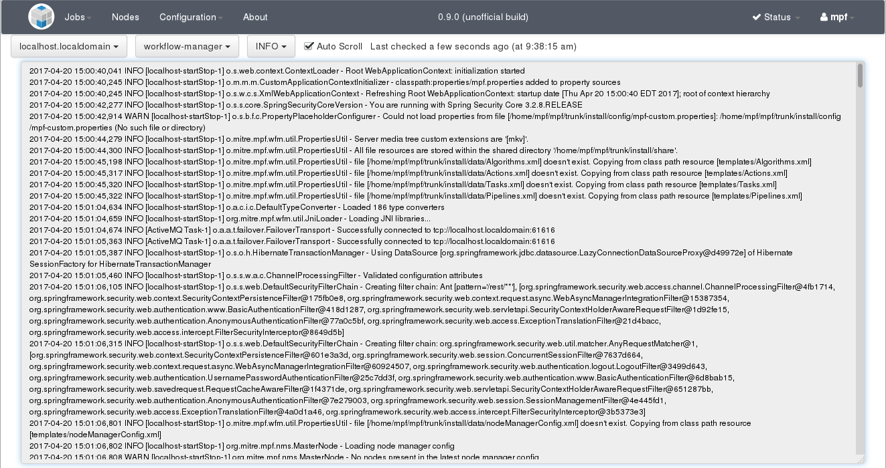

In general, all services of the same component type running on the same node write log messages to the same file. For example, all OCV face detection services on somehost-7-mpfd2 write log messages to the same "ocv-face-detection" log file. All OCV face detection services on somehost-7-mpfd3 write log messages to a different "ocv-face-detection" log file.

Note that only the master node will have the "workflow-manager" log. This is because the workflow manager only runs on the master node. The same is true for the "activemq" and "tomcat" logs.

The "node-manager-startup" and "node-manager" logs will appear for every node in the OpenMPF cluster. The "node-manager-startup" log captures information about the nodemanager startup process, such as if any errors occurred. The "node-manager" log captures information about node manager execution, such as starting and stopping services.

The "detection" log captures information about initializing C++ detection components and how they handle job request and response messages.

## Node and Process Status

This page allows a user to view the various service processes running on each node in the OpenMPF cluster:



Each service is given a unique name of the form *HOSTNAME:SERVICENAME:RANK* where *HOSTNAME* is the hostname of the node the service is configured to run on, *SERVICENAME* is the name of the service, and *RANK* is an index that is used to distinguish between multiple instances of the same service running on the same node. For example, if there are two instances of the OpenCV face detection service running on somehost-7-mpfd2 then the first one will have a rank of 1 and the second one will have a rank of 2 (not shown).

The "Node and Process Status" table shows information about the status of each service, if it is unlaunchable due to an underlying error, and how many times the node manager has attempted to restart the service if an error was detected.

## Node Configuration

This page allows a user to view the various services configured to run on each node in the OpenMPF cluster. The number to the right of each service represents the number of instances of that service configured to run on that node:



## Properties Settings

This page allows a user to view the various OpenMPF properties configured automatically or by an admin user:

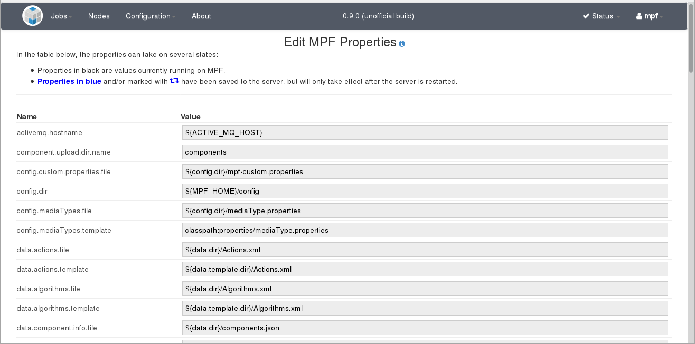

## Statistics

The "Jobs" tab on this page allows a user to view a bar graph representing the time it took to execute the longest running job for a given pipeline. Pipelines that do not have bars have not been used to run any jobs yet. Job statistics are preserved when the workflow manager is restarted.



For example, the OALPR TEXT DETECTION (WITH MARKUP) PIPELINE was run twice. One job completed in 12,000 ms and one job completed in 369,000 ms. Thus, the OALPR TEXT DETECTION (WITH MARKUP) PIPELINE bar represents 369,000 ms because that is the maximum runtime between the two jobs. Note that the Y-axis in the bar graph has a logarithmic scale. Hovering the mouse over any bar in the graph will show more information. Information about each pipeline is listed below the graph.

The "Processes" tab on this page allows a user to view a table with information about the runtime of various internal workflow manager operations. The "Count" field represents the number of times each operation was run. The min, max, and mean are calculated over the set of times each operation was performed. Runtime information is reset when the workflow manager is restarted.

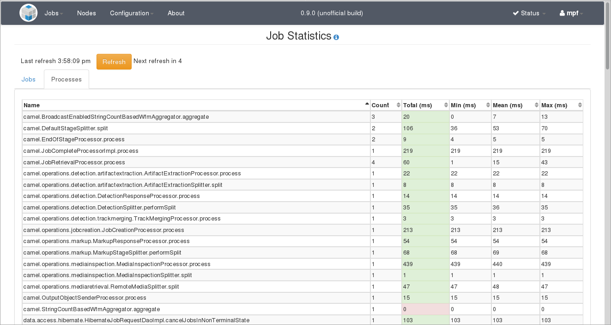

## REST API

This page allows a user to try out the various REST API endpoints provided by the workflow manager. It is intended to serve as a learning tool for technical users who wish to design and build systems that interact with the OpenMPF.

After selecting a functional category, such as "meta", "jobs", "statistics", "nodes", "pipelines", or "system-message", each REST endpoint for that category is shown in a list. Selecting one of them will cause it to expand and reveal more information about the request and response structures. If the request takes any parameters then a section will appear that allows the user to manually specify them.

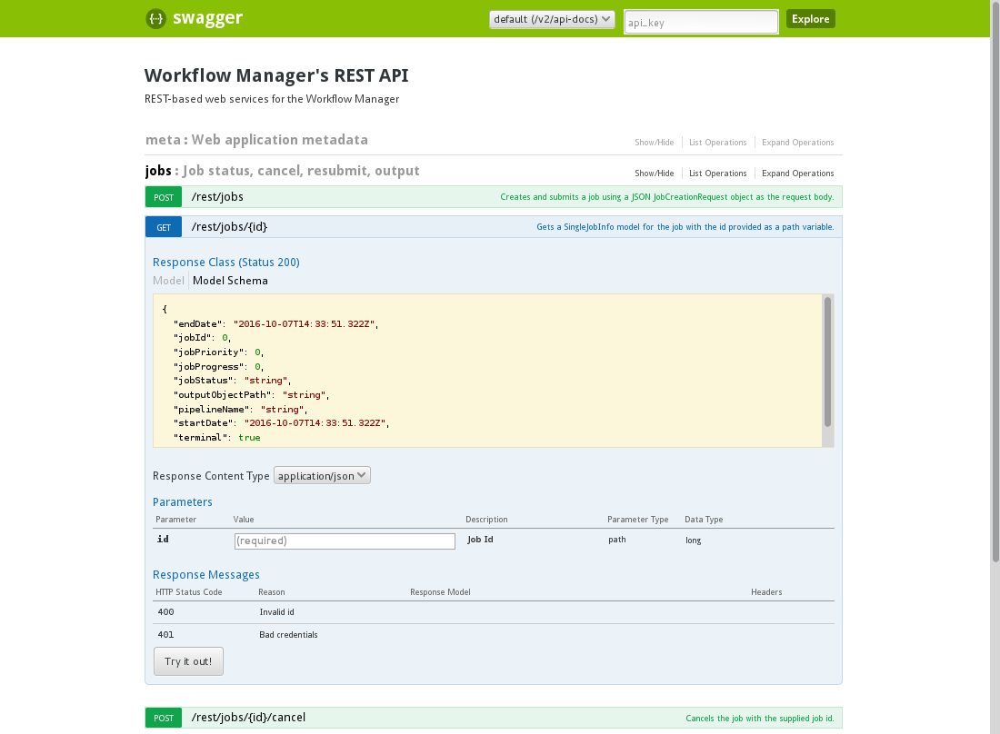

In the example above, the "/rest/jobs/{id}" endpoint was selected. It takes a required "id" parameter that corresponds to a previously run job and returns a JSON representation of that job's information. The screenshot below shows the result of specifying an "id" of "1", providing the "mpf" user credentials when prompted, and then clicking the "Try it out!" button:

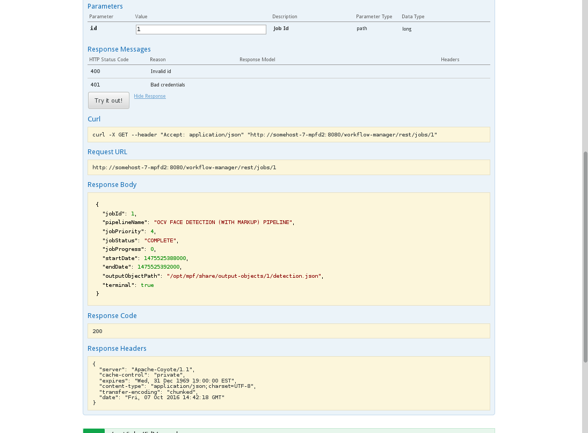

The HTTP response information is shown below the "Try it out!" button. Note that the structure of the "Response Body" is the same as the response model shown in the "Response Class" directly underneath the "/rest/jobs/{id}" label.

# Default Pipelines

Note that some distributions might not have all of the pipelines in this list depending on the components included in the deployment package and the optional components installed at deployment time. Additional pipelines may be available if third party or vendor components are installed.

## Detection Pipelines

| **Pipeline** | **Description** |
| -------- |
| OCV FACE DETECTION PIPELINE | Performs FACECV face detection. |
| DLIB FACE DETECTION PIPELINE | Performs dlib face detection. |
| OCV FACE DETECTION (WITH MOTION PREPROCESSOR AND MARKUP) PIPELINE | Performs motion preprocessing, FACECV face detection, and markup. |
| DLIB FACE DETECTION (WITH MOTION PREPROCESSOR AND MARKUP) PIPELINE | Performs motion preprocessing, DLIB face detection, and markup. |
| OCV FACE DETECTION (WITH MOTION PREPROCESSOR) PIPELINE | Performs motion preprocessing and FACECV face detection. |
| DLIB FACE DETECTION (WITH MOTION PREPROCESSOR) PIPELINE | Performs motion preprocessing and DLIB face detection. |
| OCV FACE DETECTION (WITH MARKUP) PIPELINE | Performs FACECV face detection and marks up the results. |
| DLIB FACE DETECTION (WITH MARKUP) PIPELINE | Performs DLIB face detection and marks up the results. |
| MOG MOTION DETECTION (WITH TRACKING) PIPELINE | Performs MOG MOTION detection. |
| OALPR TEXT DETECTION PIPELINE | Performs OALPR TEXT detection. |
| OALPR TEXT DETECTION (WITH MOTION PREPROCESSOR AND MARKUP) PIPELINE | Performs motion preprocessing, OALPR TEXT detection, and markup. |
| OALPR TEXT DETECTION (WITH MOTION PREPROCESSOR) PIPELINE | Performs motion preprocessing and OALPR TEXT detection. |
| OALPR TEXT DETECTION (WITH MARKUP) PIPELINE | Performs OALPR TEXT detection and marks up the results. |
| OCV PERSON DETECTION PIPELINE | Performs PERSONCV PERSON detection. |
| OCV PERSON DETECTION (WITH MOTION PREPROCESSOR AND MARKUP) PIPELINE | Performs motion preprocessing, PERSONCV PERSON detection, and markup. |
| OCV PERSON DETECTION (WITH MOTION PREPROCESSOR) PIPELINE | Performs motion preprocessing and PERSONCV PERSON detection. |
| OCV PERSON DETECTION (WITH MARKUP) PIPELINE | Performs PERSONCV PERSON detection and marks up the results. |
| SPHINX SPEECH DETECTION PIPELINE | Performs SPHINX SPEECH detection. |
| SPHINX SPEECH DETECTION (WITH MOTION PREPROCESSOR AND MARKUP) PIPELINE | Performs motion preprocessing, SPHINX SPEECH detection, and markup. |
| SPHINX SPEECH DETECTION (WITH MOTION PREPROCESSOR) PIPELINE | Performs motion preprocessing and SPHINX SPEECH detection. |
| SPHINX SPEECH DETECTION (WITH MARKUP) PIPELINE | Performs SPHINX SPEECH detection and marks up the results. |
| UNIVERSAL DETECTION PIPELINE | Performs multiple detection algorithms. |
| UNIVERSAL FACE DETECTION PIPELINE | Performs multiple face detection algorithms. |


# Detection Chaining

The OpenMPF has the ability to chain detection tasks together in a detection pipeline. As each detection stage in the pipeline completes, the volume of data to be processed in the next stage may be reduced. Generally, any detection tasks executed prior to the final detection task in the pipeline are referred to as preprocessors or filters. For example, consider the following pipeline which demonstrates the use of a motion preprocessor:



In the pipeline above, the motion preprocessor reduces the volume of data which is passed to the face detector. This is particularly useful when the input media collection contains videos captured by a fixed-location camera.  For example, a camera targeting a chokepoint such as a hallway door. The motion preprocessor will filter the input media so that only regions of video containing motion are passed on to the face detector.

Detection pipelines may be created with, or without, preprocessors and filters using the Create Custom Pipelines view.

> WARNING: Preprocessors and filters may ultimately eliminate the entirety of a media file. When an entire media file is eliminated, none of the subsequent stages in the pipeline will operate on that file. Therefore, it is important to consider the consequences of using preprocessors/filters. For example, when the motion detection receives an image or audio file, its default behavior is to return a response indicating that the file did not contain any motion tracks. If the pipeline continued to face detection then none of the image files would be eligible for that kind of detection.

## "USE_PREPROCESSOR" Property

In order to mitigate the risk of eliminating useful media files simply because they are not supported by a detector using its default settings, some algorithms expose a "USE_PREPROCESSOR" property. When a user creates an action based on a detector with this property, the user may assign this property a nonzero value in order to indicate that the detector should behave as a preprocessor as opposed to a filter. When acting as a preprocessor, a detector will not emit an empty detection set when provided with an unsupported media type, rather it will return a single track spanning the duration of the media file. Thus, when configured with the "USE_PREPROCESSOR" setting, the motion detector will not prevent images from passing on to the next stage in the pipeline, for example.

# Segmenting Media

The OpenMPF allows users to configure video segmenting properties for actions in a pipeline. Audio files (which do not have the concept of "frames") and image files (which are treated like single-frame videos) are not affected by these properties.

Segmenting is performed before a detection action in order to split work across the available detection services running on the various nodes in the OpenMPF cluster. In general, each instance of a detection service can process one video segment at a time. Multiple services can process separate segments at the same time, thus enabling parallel processing. There are two fundamental segmenting scenarios:

1. Segmenting must be performed on a video which has not passed through a preprocessor or filter.
2. Segmenting must be performed on a video which has passed through a preprocessor or filter.

In the first scenario the segmenting logic is less complex. The segmenter will create a supersegment corresponding to the entire length of the video (in frames), and it will then divide the supersegment into segments which respect to the provided "TARGET_SEGMENT_LENGTH" and "MIN_SEGMENT_LENGTH" properties.

In the second scenario the segmenting logic is more complex. The segmenter first examines the start and stop times associated with all of the overlapping tracks produced by the previous detection action in the pipeline and proceeds to merge those intervals and segment the result. The goal is to generate a minimum number of segments that don't include unnecessary frames (frames that don't belong to any tracks). For example:



## "TARGET_SEGMENT_LENGTH" Property

This property indicates the preferred number of frames which will be provided to the detection component. For example, a value of "100" indicates that the input video should be split into 100-frame segments. Note that the properties "MIN_SEGMENT_LENGTH" and "MIN_GAP_BETWEEN_SEGMENTS" may ultimately cause segments to vary from the preferred segment size.

## "MIN_SEGMENT_LENGTH" Property

This property indicates the minimum length of a segment which may be produced. If a segment is less than this value, the segment will be merged into the segment adjacent to it. If no segments are adjacent to the short segment, the segment will be ignored and will not produce a work unit. In other words, the frames associated with that short segment will not be processed by the rest of the pipeline.

### Example 1: Adjacent Segment Present

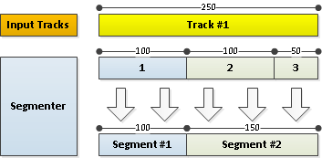

1. In this example, a preprocessor has completed and produced a single track.
2. The next detection action specifies the following parameters:
  * "TARGET_SEGMENT_LENGTH" = 100
  * "MIN_SEGMENT_LENGTH" = 75
3. Three segments are initially produced from the input track with lengths corresponding to 100 frames, 100 frames, and 50 frames.
4. Since the last frame does not exceed the minimum specified segment length, it must either be discarded or merged with an adjacent segment.
5. Segments 2 and 3 are determined to be adjacent, so they are merged.
6. Ultimately, two segments are produced.

### Example 2: No Adjacent Segment

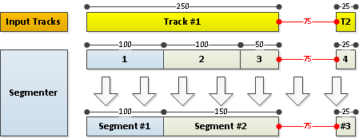

1. In this example, a preprocessor has completed and produced two non-overlapping tracks.
2. The next detection action specifies the following parameters:
  * "TARGET_SEGMENT_LENGTH" = 100
  * "MIN_SEGMENT_LENGTH" = 75
  * "MIN_GAP_BETWEEN_SEGMENTS" = 50
3. The segmenter begins by merging any segments which are less than "MIN_GAP_BETWEEN_SEGMENTS" apart. There are none.
4. The segmenter then splits the existing segments using the "MIN_SEGMENT_LENGTH" and "TARGET_SEGMENT_LENGTH" values.
5. The segmenter iterates through each segment produced. If the segment satisfies the minimum length constraint, it moves to the next segment.
  * When it reaches the third segment and finds the length of 50 frames does not exceed the minimum length, it merges that segment with the previous adjacent segment.
  * When it reaches the final segment and finds that the length of 25 frames does not exceed the minimum length, and that there are no adjacent segments, the segment is destroyed.
6. Ultimately, only two segments are produced.

## "MIN_GAP_BETWEEN_SEGMENTS" Property

This property is important to pipelines which contain preprocessors or filters and controls the minimum gap which must appear between consecutive segments. The purpose of this property is to prevent scenarios where a preprocessor or filter produces a large number of short segments separated by only a few frames. By merging the segments together prior to performing further segmentation, the number of work units produced by the segmenting plan can be reduced, thereby reducing pipeline execution time.

Consider the following diagram, which further illustrates the purpose of this property:



1. The user submits a video to a pipeline containing a motion preprocessor followed by another extractor (e.g., face).
2. The video is initially split into segments using the properties provided by the motion preprocessor. Specifically, the preprocessor action specifies the following parameters and four segments are produced:
  * "TARGET_SEGMENT_LENGTH" = "250"
  * "MIN_SEGMENT_LENGTH" = "150"
  * "MERGE_TRACKS" = "true"
3. The segments are submitted to the motion preprocessor, and five distinct and non-overlapping tracks are returned based on the frames of the segments in which motion is detected.
4. Because the "MERGE_TRACKS" property is set to "true", tracks are merged across segment boundaries if applicable. This rule is applied to each pair of tracks that are only one frame apart (adjacent). Consequently, only three tracks are ultimately derived from the video. (The number of tracks is reduced from five to three between the "Preprocessor" and "Track Merger" phases of the diagram.)
5. The non-overlapping tracks are then used to form the video segments for the next detection action. This action specifies the following parameters:
  * "TARGET_SEGMENT_LENGTH" = "75"
  * "MIN_SEGMENT_LENGTH" = "25"
  * "MIN_GAP_BETWEEN_SEGMENTS" = "99"
6. The segmenting logic merges tracks which are less than "MIN_SEGMENT_LENGTH" frames apart into one long segment. Once all tracks have been merged, each segment is itself segmented while respecting the provided "TARGET_SEGMENT_LENGTH" and "MIN_SEGMENT_LENGTH" properties. Ultimately, ten segments are produced. (Track #1 and Track #2 in the "Track Merger" phase of the diagram are combined, which is why Segment #3 in the "Segmenter" phase of the diagram includes the 25 frames that span the gap between those two tracks.)
